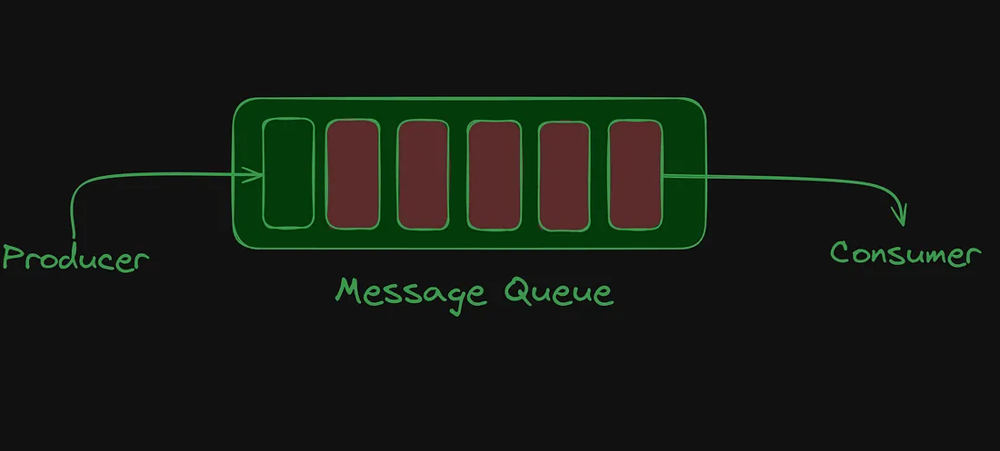
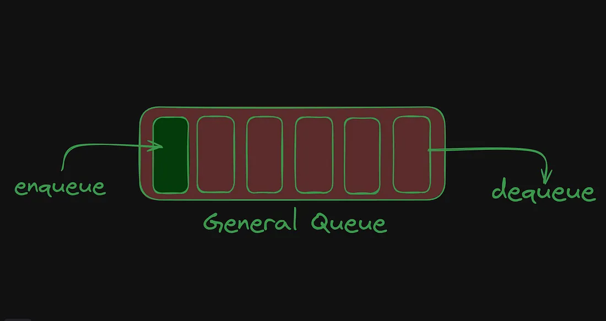
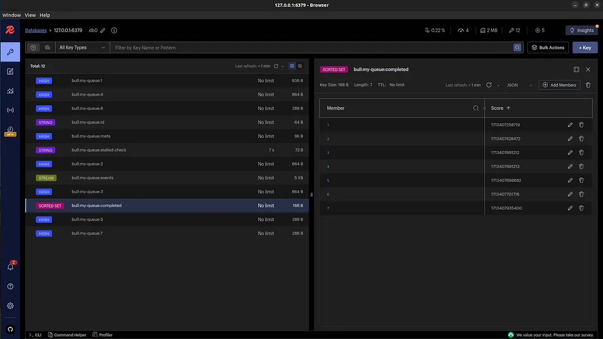

# Implementing Message Queues with BullMQ

Message Queues are a fundamental concept in modern application architecture, allowing different parts of a system to communicate and process data asynchronously. This guide introduces the concept of message queues, explains their importance, and walks you through implementing one using BullMQ, a Node.js library.

## Introduction to Message Queues


Message Queues facilitate the sequential processing of data based on the First In, First Out (FIFO) principle. They serve as a lightweight, temporary storage for messages, enabling one-to-one or one-to-many communication between different parts of a system. This mechanism is crucial for integrating applications across diverse platforms, ensuring data integrity, security, and fault tolerance in critical operations like financial transactions, booking systems, and healthcare record management.

### What is a Queue?



A queue is a data structure that operates on the FIFO principle. Operations include "enqueue" for insertion and "dequeue" for removal. Variants of queues include:

- Circular Queue
- Double Ended Queue (Deque)
- Priority Queue

### What is a Message Queue?

A Message Queue extends the basic queue concept by introducing roles for message producers and consumers. It ensures that messages are processed exactly once, supporting fault tolerance by redirecting erroneous messages to an error queue for reprocessing.

## Implementing Message Queues with BullMQ

BullMQ is a high-performance, Redis-backed Node.js library for working with message queues. It supports exactly-once queue semantics and is designed for easy horizontal scaling.

### 1. Installation

First, install BullMQ and set up Redis:

```bash
npm install bullmq
docker run -itd -p 6379:6379 redis
```

### 2. Creating a Producer

Producers send messages to the queue. To create a producer, you can create a file called `producer.js` and add the following code:

```
Look at producer.js
```

### 3. Creating a Consumer

Consumers process messages from the queue. To create a consumer, you can create a file called `consumer.js` and add the necessary code to process the messages.

```
look at consumer.js
```

### 4. Visualizing Queues

Use Redis Insights or Medis (for Mac users) to visualize and manage your queues effectively.



